# Node-RED オリジナルノードの開発

## はじめに
本ハンズオンは、Node-RED公式サイトを元に、手順をまとめ直したものになります。ここでは、初めてノード開発を行う方向けに手順をシンプルにしています。
オリジナルの情報は [Node-RED公式サイト ノードの開発](https://nodered.jp/docs/creating-nodes/) を御覧ください。

## 事前準備
本ハンズオンを実施するに当たり、以下を事前準備してください。
* [GitHub](https://gist.github.com/) アカウント作成
* [npm](https://www.npmjs.com/) アカウント作成
* [Node-RED](https://nodered.jp/) インストール (ローカル環境へのスタンドアロン)
* [IBM Cloud](https://ibm.biz/BdqQjC) アカウント作成

## 全体の流れ
ノード開発の主な流れは以下の通りです。
1. ノードプログラム開発(JavaScript)
2. ノード外観作成(HTML)
3. パッケージ化
4. ノードのインストール
5. ノード名の変更
6. ノード処理の変更
7. ノードアイコン変更
8. ノード色変更
9. Node-RED Libraryへの公開
10. 公開したノードの削除
11. 公開したノードのインストール

## ノード開発のポリシー
新しいノードを作成する時には、いくつかの一般的なルールに従う必要があります。これらはコアノードで採用されているアプローチに準拠しており、一貫したユーザーエクスペリエンスを提供します。

ノード作成においては以下のルールに従います:

* 目的が明確に定義されていること
    * APIに含まれるすべての項目を設定できるようにしたノードは、 単一の目的のために分割した複数のノードよりも使いにくいことが多いです。

* 元の機能に関係なく簡単に使えること
    * 複雑さを隠蔽して専門用語やドメイン固有の知識の使用を避けます。

* 多様なメッセージ型が渡されても正常に処理できること
    * メッセージは文字列、数値、Boolean、Buffer、オブジェクト、配列、nullなどの様々な型で渡される可能性があります。 いずれの型であっても正しく処理される必要があります。

* 送信される内容に一貫性を持つこと
    * ノードはメッセージにどのようなプロパティを追加するのかを文書化する必要があり、動作において一貫性があり、 予測可能でなければなりません。

* フローの先頭、中間、または末尾に配置されるようにすること - すべてを一度にしようとしないこと

* エラーをキャッチすること
    * ノードがキャッチできないエラーをスローすると、 Node-REDはシステム全体の状態がわからなくなるため停止します。
    * ノードはできるかぎり、 エラーをキャッチするか非同期呼び出しのためのエラーハンドラを登録しなければなりません。


## 1. ノードプログラム開発(JavaScript)
Node-REDのノードは、処理を定義するJavaScriptファイルと、設定画面などのUIを提供するhtmlファイルの2つから構成されています。
JavaScriptでは、前のノードから渡されたメッセージに対して行う処理を実装します。htmlファイルは、Node-REDのフローエディタで表示されるプロパティ設定画面が記述されています。このhtmlファイルで表示したプロパティ設定画面で入力した設定値をjsファイルから呼び出して処理を行います。

### 1-1. 開発用リポジトリの準備
https://github.com/ へアクセスし、GitHubアカウントでログインします。
GitHubページの右上にある「＋」プルダウンから「New repository」を選択します。


ここで作成するリポジトリは、ノードを開発するためのプロジェクトとして存在し、その後パッケージ化されてnpmへ公開されるものになります。（公開するかどうかはもちろん任意です）

ですので、リポジトリ名はノード開発の命名規則に沿ったものにしましょう。

ルールでは「node-red-contrib-<ノードのグループを表す名称>ですので、これに従います。以下の画像ので例では「node-red-contrib-taiponrock」にしています。
リポジトリ名を指定したら、リポジトリ公開範囲をPublicにし、READMEファイルのチェックをONにして、ライセンスを指定します。例ではApache License 2.0ライセンスで作成します。
すべて設定したら「Create repository」ボタンをクリックしてリポジトリを作成してください。


無事リポジトリが作成されました。


### 1-2. リポジトリのClone
では、次にローカルの開発環境に、先程作成したリポジトリをクローンしましょう。

リポジトリのURLをクリップボードへコピーします。緑色の「Code」のプルダウンをクリックして、クリップボードボタンをクリックしてURLをコピーします。


リポジトリをローカルに取得(git clone)
Bashが実行できるコマンドラインインターフェース（ターミナルなど）からリポジトリをクローンする（コピーする）作業ディレクトリへ移動します。ここでは、ユーザーディレクトリの下へworkディレクトリを作成し、そこへ移動しました。

```
$ mkdir work
$ cd work
```


先程作成したリポジトリのURLで```git clone```コマンドを実行してください。クローンが終了したら、```ls```コマンドで正常にクローンされていることを確認しましょう。

```
git clone https://github.com/<GitHubアカウント>/node-red-contrib-<指定した任意の文字列>.git
```


### 1-3. Javascriptの作成
ここからは、実際のノードの処理を作成します。と、言ってもすでにコードは用意してありますのでご安心ください。
用意してあるコードは非常にシンプルな処理のノードになります。インプットとして渡された文字列を小文字(lower case)に変換するだけの処理です。

まずは、クローンしたリポジトリのディレクトリの中へ移動します。

```
cd node-red-contrib-<指定した任意の文字列>
```


こちらのディレクトリ配下に、以下のコードの通り **node.js** というファイル名で、ファイルを作成します。
```
module.exports = function(RED) {
    function LowerCaseNode(config) {
        RED.nodes.createNode(this,config);
        var node = this;
        node.on('input', function(msg) {
            msg.payload = msg.payload.toLowerCase();
            node.send(msg);
        });
    }
    RED.nodes.registerType("lower-case",LowerCaseNode);
}
```


node.jsが作成されました。


ここではviを使って作成していますが、もちろん任意のエディターを使って構いません。

### 1-4. HTMLの作成
続いて、同じディレクトリ配下に、以下のコードの通り **node.html** というファイル名で、ファイルを作成します。

```
<script type="text/javascript">
    RED.nodes.registerType('lower-case',{
        category: 'function',
        color: '#a6bbcf',
        defaults: {
            name: {value:""}
        },
        inputs:1,
        outputs:1,
        icon: "file.png",
        label: function() {
            return this.name||"lower-case";
        }
    });
</script>

<script type="text/html" data-template-name="lower-case">
    <div class="form-row">
        <label for="node-input-name"><i class="icon-tag"></i> Name</label>
        <input type="text" id="node-input-name" placeholder="Name">
    </div>
</script>

<script type="text/html" data-help-name="lower-case">
    <p>A simple node that converts the message payloads into all lower-case characters</p>
</script>
```


node.htmlが作成されました。


## 2. パッケージ化
ノードの処理(JavaScript)と外観(HTML)の作成が終えたので、今度はそれをパッケージ化していきます。Node-REDはそのフローエディタ自身がnode.jsアプリであり、そこの上で動く各ノードもまたnode.jsアプリということになります。つまり、ここでのパッケージ化というのは **npm** を使った処理のことです。

npmについてはここでは詳しく説明しません。詳細を知りたい方は [npm公式サイト](https://www.npmjs.com/) へアクセスいただくか、各種技術記事などをご参照ください。

### 2-1. npmの初期化処理
先程、node.jsやnode.htmlを作成したディレクトリと同じ場所で、以下の通りコマンドを実行します。

```
npm init
```

npm initを実行すると、対話式に各種パラメーターを聞かれますので、いかに従い入力して先に進んでください。

| 項目 | 設定値 |
----|---- 
| name | デフォルト値 |
| version | デフォルト値 |
| description | ノードの説明 (ライブラリやインストール時の説明として表示される) |
| entry point | デフォルト値 |
| test command | ※入力不要 |
| git repository | デフォルト値 |
| keywords | インストール時の検索等で用いるキーワードをカンマ区切りで指定。今回はライブラリ登録予定なので「node-red」を忘れずに入力すること。 |
| author | npmアカウント名 |
| license | Apache-2.0 (任意のものでOK) |


最後まで対話を終了するとnpm initコマンドにより **package.json** が生成されます。


### 2-2. package.jsonの編集
package.jsonには、手動でNode-RED固有の設定を追加する必要があります。package.jsonファイルをテキストエディタで開き、以下の様に"name"や"version"と並列して ```"node-red":{"nodes":"{"lower-case":"node.js"}},``` の部分を追加します。

```
{
  "name": "node-red-contrib-<指定した任意の文字列>",
  "version": "1.0.0",
  (省略)
  "node-red" : {
    "nodes": {
      "lower-case": "node.js"
    }
  },
  (省略)
}
```


## 3. ノードのインストール
ここまでで作成したノードを、ローカル環境のNode-REDへ追加していきましょう。

ノードモジュールをローカルでテストするには ```npm link``` コマンドを使うことができます。 これにより開発中において、ローカルディレクトリでノードを開発し、ローカルのNode-REDインストールにリンクさせることができます。

CLI上で以下の通りコマンドを実行し、ノードの追加とNode-REDの起動を行います。

```
$ cd <ノードモジュールへのパス>
$ npm link
```


これにより、ディレクトリへ適切なシンボリックリンクが作成され、 Node-REDは起動時にノードを検出します。 Node-REDを再起動するだけで、ノードのファイルに対する変更を取得できます。

コマンドラインで ```node-red``` コマンドを実行し、ローカルのNode-REDを起動します。すでに起動済みの場合は再起動してください。

起動後（再起動後）のパレットのfunctionカテゴリに **lower case** というノードが追加されていることが確認できるはずです。


では、ちゃんと使えるか試してみましょう。
以下のようにフローを作成します。 **Inject** -> **lower case** -> **debug** の各ノードをシーケンシャルにつなぎます。Injectノードのプロパティから、文字列型に設定し、任意の文字列をすべて大文字で出力するよう設定します。例えばここでは「MY NAME IS TAIJI」としています。

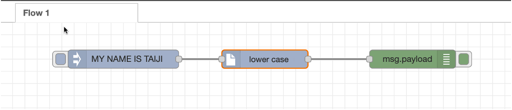

作成したフローをデプロイして、Injectノードを実行すると、設定したすべて大文字の文字列がすべて小文字へ変換されてデバッグウィンドウへ出力されたことが確認できます。

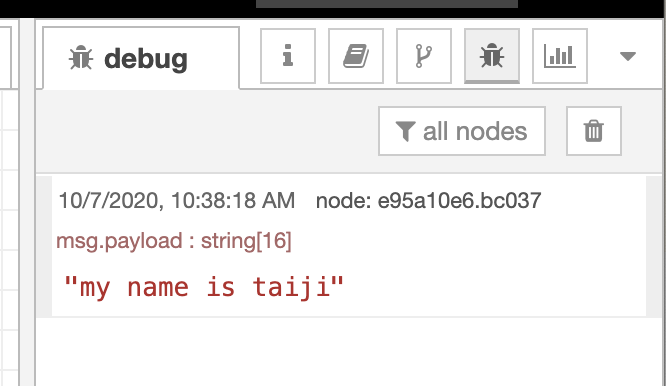


## 4. ノードのカスタマイズ
自分で作成したノードが、ローカル環境で使えることが確認できました。ここからは、そのノードをカスタマイズしていきます。JavaScriptやHTMLの修正を行うことで、そのノードの処理や外観を編集することが可能です。これらの変更は、Node-REDを再起動すると反映されます。

### 4-1. ノード名の変更
現状、作成したノードはノード名がサンプルプログラムの「lower-case」のままです。ここでは、この名前を任意の名前に変更します。以下の手順に従ってください。

1) pakcage.jsonに記述されている **lower-case** を自分のノード名に変更<br>
例はノードのリポジトリが **node-red-contrib-taiponrock** なので **taiponrock** ノードに変更します。

変更前：
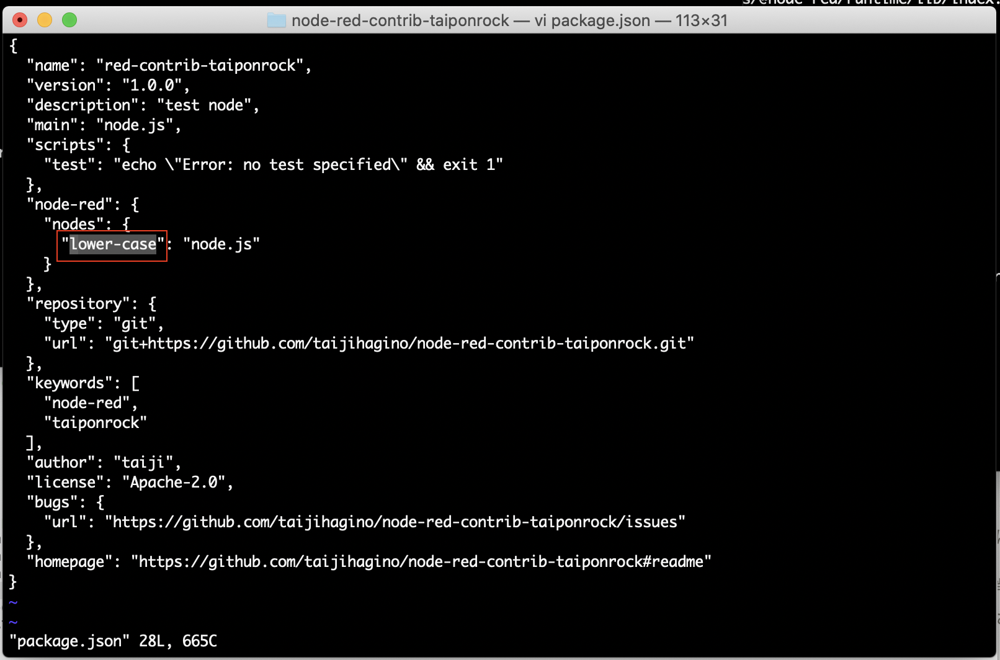

変更後：
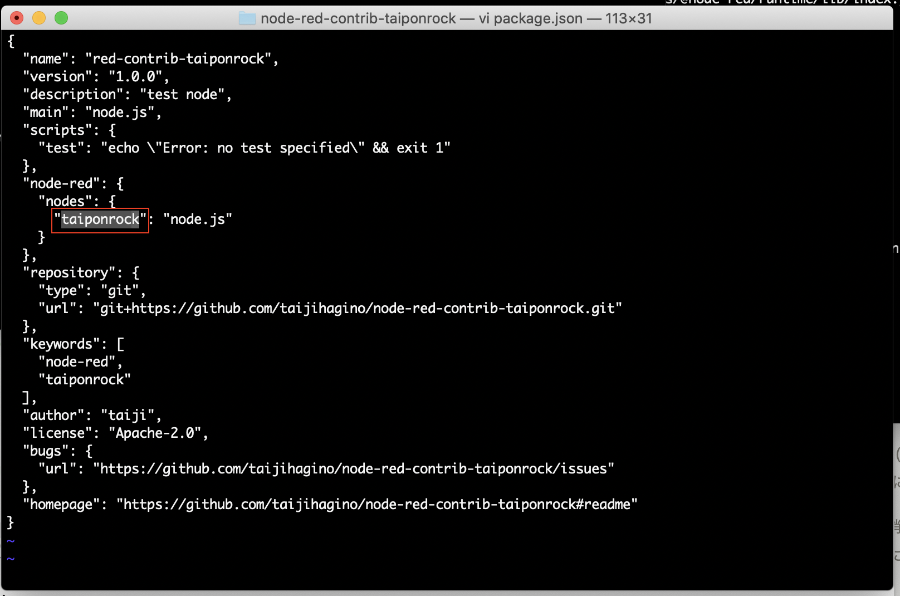

2) node.jsに記述されている **lower-case** と **LowerCaseNode** を自分のノード名に変更
<br>
例は **lower-case** を **taiponrock** に、 **LowerCaseNode** を **TaiponrockNode** に、それぞれ変更します。

変更前：
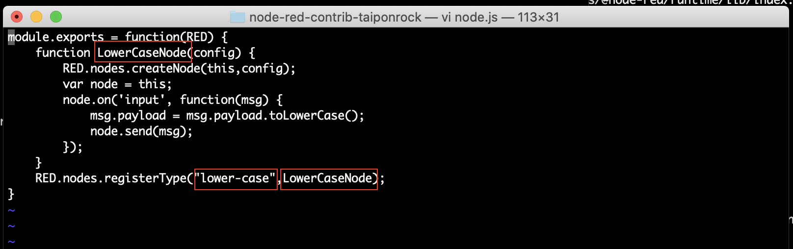

変更後：
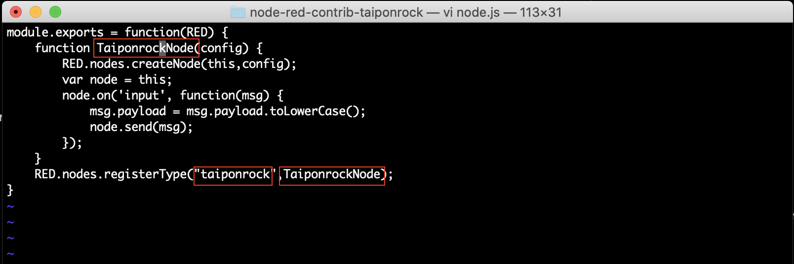

3) node.htmlに記述されている **lower-case** を自分のノード名に変更
<br>
例は **lower-case** を **taiponrock** に変更します。

変更前：
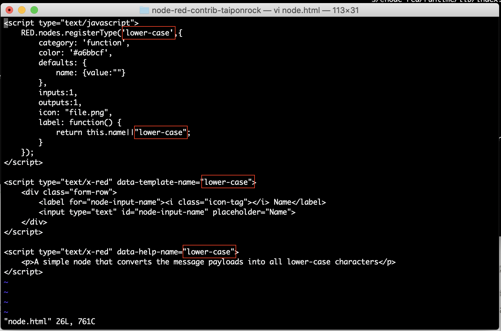

変更後：
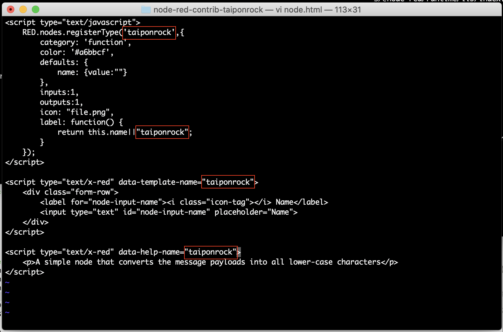

Node-REDを再起動すると、正しく名前が変更されていることを確認できます。

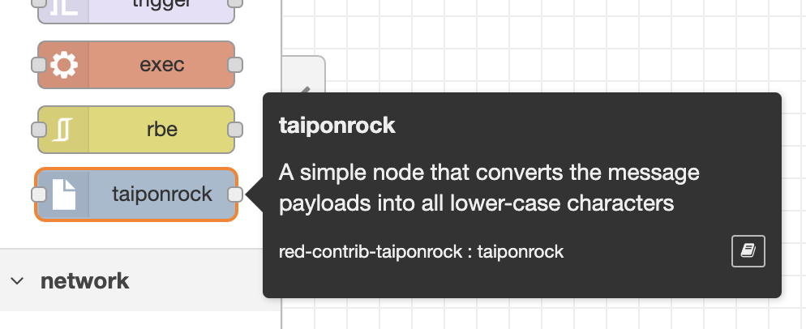

### 4-2. ノード処理の変更
ノードの処理を実装しているのは主に以下の部分になります。ここで定義している ```msg.payload = msg.payload.toLowerCase();``` の部分を書き換えると、ノードの処理を変更できます。

node.js
```
(省略)
node.on('input', function(msg) {
    msg.payload = msg.payload.toLowerCase();
    node.send(msg);
}
(省略)
```

ここでは、作業をわかりやすくするために、自分の名前やニックネームの文字列を返却するだけのメソッドへ変更してみます。 以下のようにnode.jsを書き換えてみましょう。

node.js
```
(省略)
node.on('input', function(msg) {
    msg.payload = "Taiponrock";
    node.send(msg);
}
(省略)
```

では、ちゃんと変更されたか試してみましょう。
先ほど作成したフローを使います。 **Inject** -> **lower case** -> **debug** のlower caseノードが名前と処理を変更したノードに変更されていますが、一度デプロイし直して上げる必要があります。わかりやすいように、一度元lower caseノードだったノードを削除して、再度配置し直します。

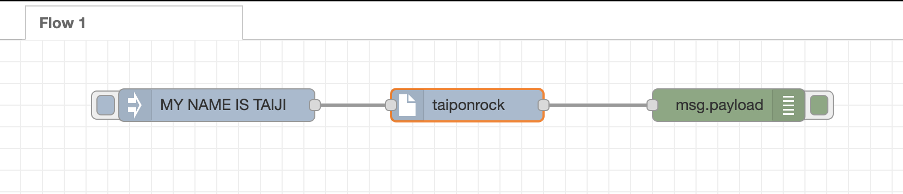

作成したフローをデプロイして、Injectノードを実行すると、先程処理変更で定数として設定した文字列（名前またはニックネーム）が、デバッグウィンドウへ出力されたことが確認できます。

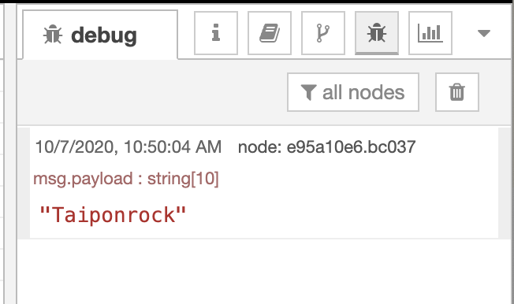

### 4-3. ノードアイコン変更
ノードのアイコンは、定義内のiconプロパティに指定します。

プロパティの値は、文字列または関数を設定できます。

プロパティの値が文字列の場合は、その文字列をアイコン名として扱います。

プロパティの値が関数の場合は、ノードが最初に読み込まれた時、またはノードが編集された後に評価されます。関数はアイコン名として使う文字列を返すようにしてください。

関数は、ワークスペース上のノード（thisが参照するノードインスタンス）と、パレット上のノードの両方のアイコンを表示するために使用されます。 パレット上のノード向けの場合、thisは特定のノードインスタンスを参照しません。 関数は有効な値を返す必要があります。

```
icon: "file.png",
```

アイコンは次のいずれかとなります:

* Node-REDによって用意されたアイコンの名前
* モジュールによって用意されるカスタムアイコンの名前
* [Font Awesome 4.7](https://fontawesome.com/v4.7.0/icons/)のアイコン

ここでは、Node-REDがデフォルトで用意しているアイコンを使って変更しましょう。
ノードのアイコンを変更するには、node.htmlファイルの"icons"の設定を変更します。Node-REDはデフォルトで以下の様なアイコンを持っています。

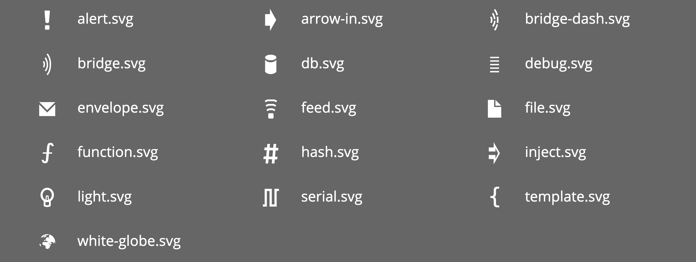

好きなアイコンを選んでください。例では **bridge.svg** を使います。

注意：
Node-RED 1.0以降、見栄えを良くするためにこれらのアイコンがすべてSVGに置き換えられました。下位互換性を確保するために、pngを指定することも可能ですが、エディターはpngとしてのリクエストをSVGに自動的に変更します（利用可能な場合）。ですので、SVGを指定するほうが良いでしょう。

node.htmlを開いて以下のように編集してください。

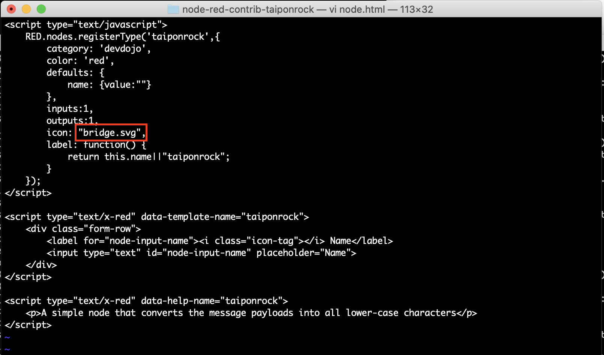

Node-REDを再起動して、アイコンが変更されていることを確認します。

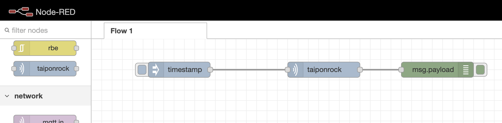

### 4-4. ノード色変更
ノード色の変更はかんたんです。アイコンの変更時と同じように、node.htmlファイルの中に記述されている"color"要素の設定を変更するだけです。ここでは"red"を指定しました。

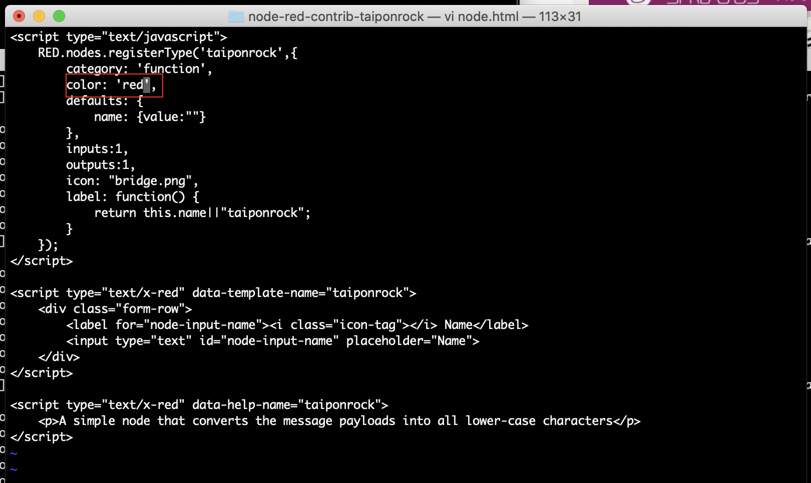

Node-REDを再起動して、ノード色が変更されていることを確認します。

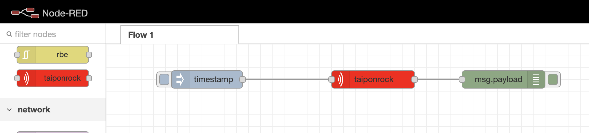

### 4-5. カテゴリー変更
ノードが所属するカテゴリーを変更します。現状はサンプルコードをそのまま使っていたので、このノードの所属するカテゴリーは **function** でした。

ここでは、試しに新しく **devdojo** カテゴリを設けて、そこへ所属させたいと思います。node.htmlファイルの中に記述されている"category"要素の値を **function** から **devdojo** へと変更してください。

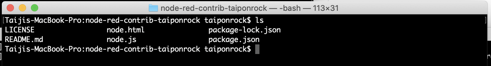

Node-REDを再起動して、所属カテゴリーが変更されていることを確認します。

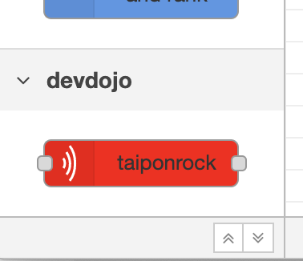


他にも、外観変更についての詳細を知りたい方は[Node-REDの公式サイト](https://nodered.jp/docs/creating-nodes/appearance)をご確認ください。

## 5. Node-RED Libraryへの公開
作成したノードを [Node-RED Library](https://flows.nodered.org/) に公開するために、いくつか作業が必要となります。

### 5-1. README.mdの整備
ノードの説明を **README.md** へ記載していきましょう。
README.mdファイルは十分な情報が記載されているかを、クローラーに自動判定されているようです。このため、一定文字数以上の内容を書かないとNode-RED Libraryに登録されないようです。
記載する言語は、世界中の方へ公開するのを考慮すると英語の方が良いですが、今回はハンズオンの一貫でテスト的に公開するので日本語でも大丈夫です。

参考として、例えば以下の内容などを記載してあると望ましいです。

* 概要説明
* 使用方法
* スクリーンショット
* 本ノードを用いたサンプルフロー
* 前提環境
* 更新履歴

ここでは、ハンズオンということで完結に概要と使用方法のみを記載していきます。以下の内容でREADME.mdを更新してください。


```
# node-red-contrib-<指定した任意の文字列>

## 概要
本ノードは、インプットとして渡されてきたアルファベット文字列をすべて強制的に「Taiponrock」という文字列へ変換するためのノードです。

渡されてきたインプットパラメーターが文字列以外でも、強制的に「Taiponrock」が返却されます。もはや避けようがありません。

本処理では、JavaScriptにおけるStringオブジェクトのインスタンスメソッドであるtoLowerCaseを実行していたサンプルノードをなんの意味もない定数を返却するだけの処理に変更した素晴らしいノードです。


## 使用方法
渡すパラメーターの文字列をすべて強制的に「Taiponrock」へ変換したい場合に使用します。自己顕示欲や承認欲求を満たすためだけの自己満足として使用されます。自身の精神衛生上を考慮し、使用頻度には十分ご注意ください。
```

編集したらREADME.mdは保存して閉じておきます。

### 5-2. ファイルのアップロード
**node.js node.html package.json README.md LICENSE** の5つのファイルがあることを確認します。（package.lock.jsonが含まれていても問題ありません）


これらのファイルをGitHub上のリポジトリへアップロードします。
これまでの作業は、クローンしたリポジトリのディレクトリで行っているはずですが、もし別の場所へいる場合は当該リポジトリのディレクトリへ移動します。
その上で以下のコマンドを実行しましょう。

```
git add .
git commit -m "Node has been published"
git push
```

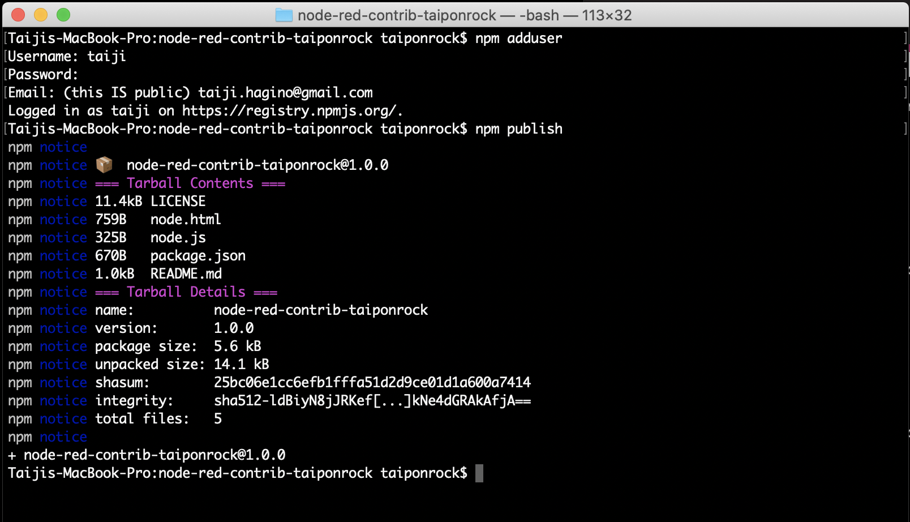


git commitでメールアドレスとユーザ名を求められた場合は、自分のGitのユーザー名とメールアドレスを設定します。以下のコマンドを実行することで環境変数へ設定しておくことができます。

```
git config --global user.email "<メールアドレス>"
git config --global user.name "<ユーザ名>"
```

git pushでGitHubへのログインを求められた場合は、GitHubアカウントのユーザ名とパスワードを入力します。

pushが正常に終了すると、GitHub上のリポジトリで対象のファイルがアップロードされていることが確認できます。

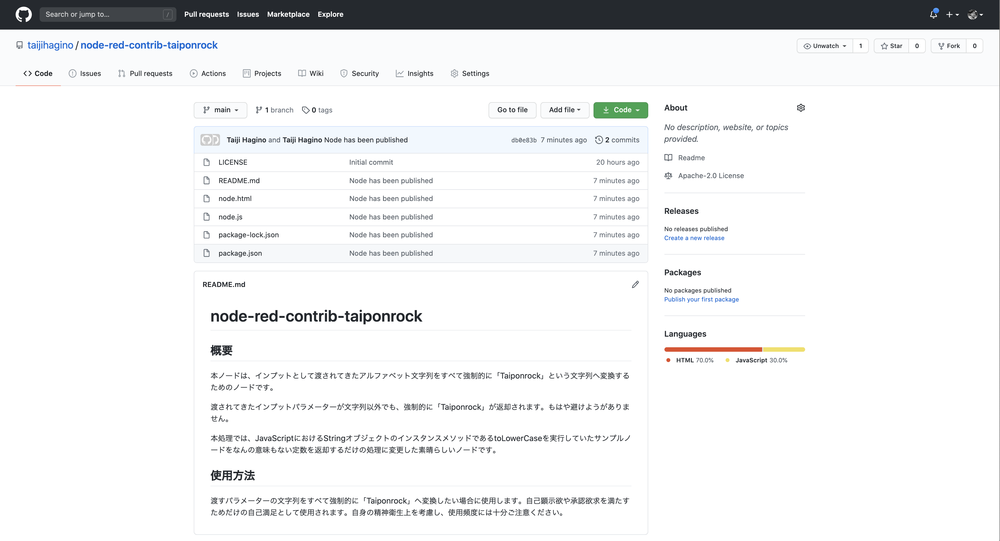

### 5-3. npmへのノード公開 (npm publish)
では次に、ノードをモジュールとして公開します。npmコマンドを用いてファイル一式をアップロードします。ここでも同じく、クローンしたリポジトリのディレクトリで作業を行います。

```
npm adduser
npm publish
```


```npm publish``` を実行する際にバージョンの確認が行われます。2回目以降 ```npm publish``` を実行する際にはバージョンが上がっている必要があるので、pachage.jsonを編集してバージョン番号を上げることを忘れないでください。

publishが正常に終了すると https://www.npmjs.com/package/node-red-contrib-<任意の文字列> というURLにて公開されます。

例だと https://www.npmjs.com/package/node-red-contrib-taiponrock になります。

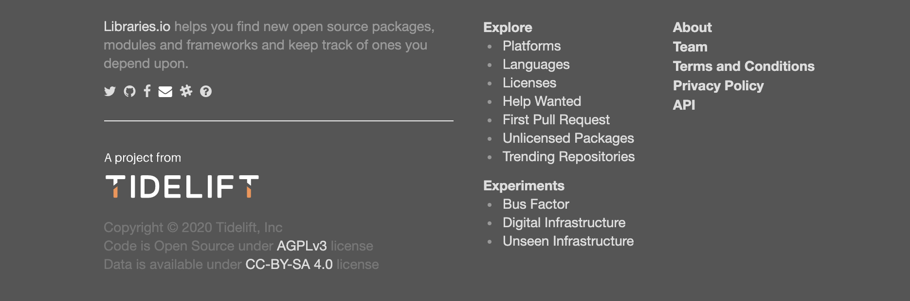

### 5-4. Node-RED Libraryへの登録
Node-RED Libraryの[Adding a node](https://flows.nodered.org/add/node)より、作成したノードを登録します。

Add your node to the Flow Libraryに、作成したノードの名称を入力して **add node** ボタンをクリックします。

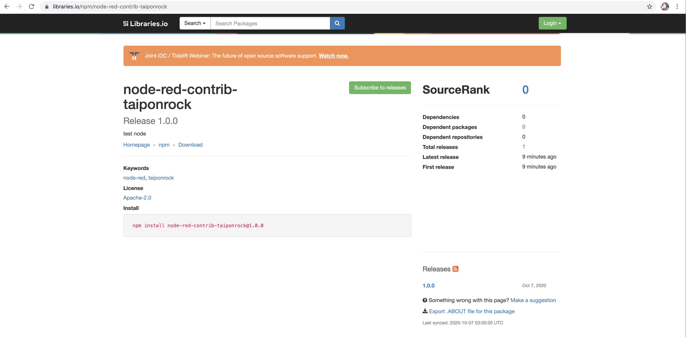

登録が完了すると、作成したノードがライブラリーへ追加されたことが確認できます。

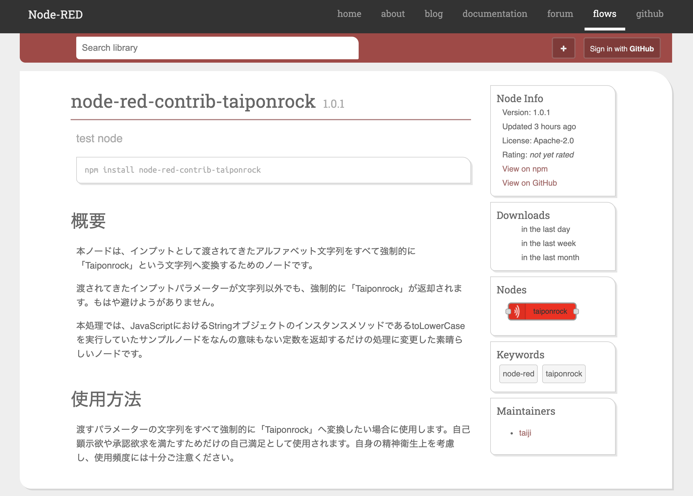

Node-RED Libraryにて登録作業を行ってから、実際にNode-REDフローエディター上で検索にHITするようになるまで15分程度かかりますのでご注意ください。

バージョンを上げて再度publishを行った場合は、Node-RED Libraryの自分のnodeのページからリフレッシュを行ってください。ノード画面の右側Actionsパネルの下にある **request refresh** をクリックすればOKです。

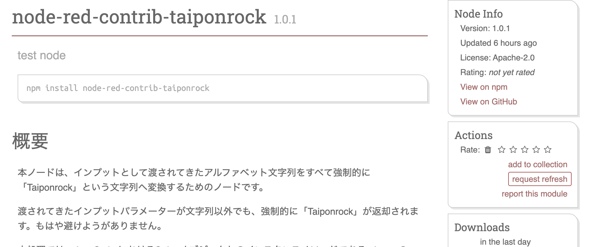

## 6. 公開したノードの削除
公開したノードの削除には注意が必要です。現在(2020/10時点)、[npmのパッケージのunpublishポリシー](https://www.npmjs.com/policies/unpublish)によると、unpublish期限は **公開24時間以内から72時間以内** である。また、72時間以上でも **ダウンロード数300未満** など特定条件を満たす影響の少ないパッケージならunpublish可能としている。

こちらの情報は随時更新されることが想定されるので、最新情報はnpmの公式サイトを適宜参照してください。

unpublishを行ったあと、更新時と同じようにNode-RED Libraryの自分のnodeのページからリフレッシュを行ってください。ノード画面の右側Actionsパネルの下にある **request refresh** をクリックすればOKです。

unpublishはモジュールのディレクトリ（Cloneしたリポジトリのディレクトリ）配下で、以下のコマンドを実行します。

```
npm unpublish --force node-red-contrib-<任意の文字列>
```

## 7. 公開したノードのインストール
ここの章は、「5-4. Node-RED Libraryへの登録」の作業後、15分以上経ってから実施することをおすすめします。

ローカル環境のNode-REDでは自作ノードをそのまま使えるように反映させました。また、公開用にnpmへpublishして、Node-RED Libraryにもノード登録を行いました。これで、だれでもこのノードを使うことができるようになったはずです。

ここでは、試しにIBM CloudのNode-REDから、今回作成したノードが問題なくインストールして使えるかを確認していきましょう。

IBM Cloudのアカウントが必要になります。お持ちでない方は[こちら](https://ibm.biz/BdqQjC)から作成して下さい。

IBM Cloudにログインし、Node-REDサービスを作成してNode-REDフローエディタを起動します。フローエディターのパレットの管理を開きます。

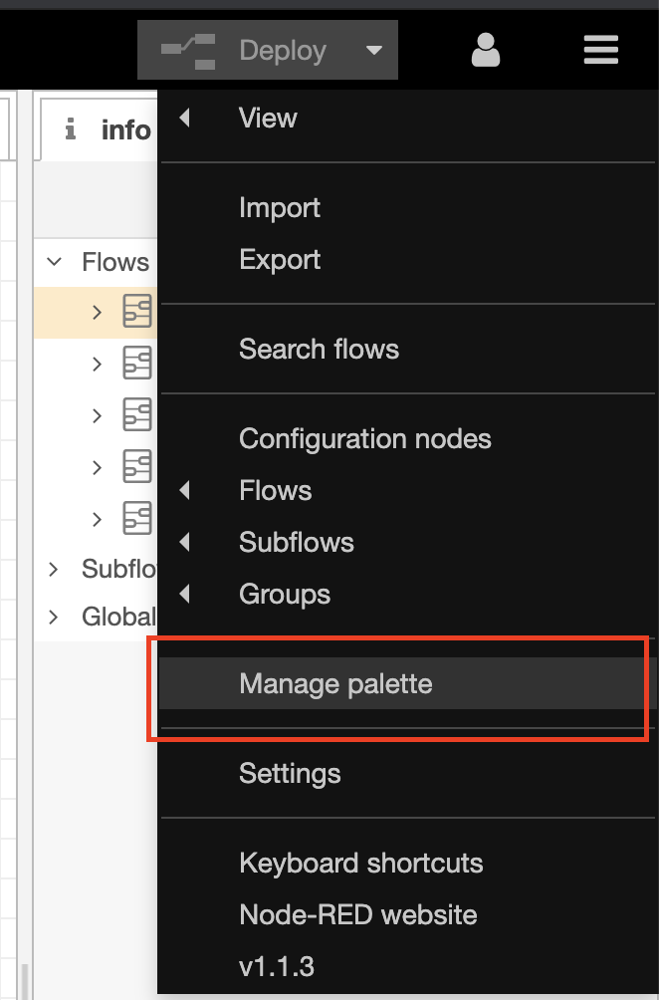

Installタブを選択し、自分で作成したノード名の一部を入力して検索します。検索結果で自作したノードが表示されれば公開されインストール対象になっているということです。Installボタンをクリックしてインストールしましょう。

※ ここで検索結果に表示されない場合、ノード登録からまだ時間が短すぎる可能性があります。30分〜1時間後に再度試してみてください。それでも検索にHITしない場合は何かしらの原因があると思われますので、これまでの手順を見直して再度実施してみてください。

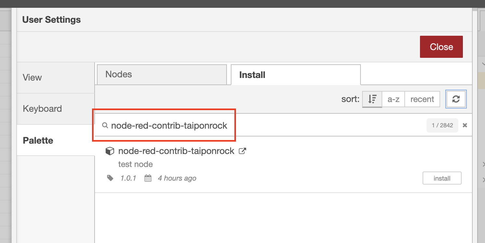

パレットに自作したノードが、自分で設定したカテゴリーで表示されていることを確認します。


以下の図のようにフローを作成してInjectノードを実行します。例は、Node-REDフローエディターを初回起動した際にデフォルトで用意されている **Hello Node-RED!** のフローの間に、自作ノードを挟んでみています。

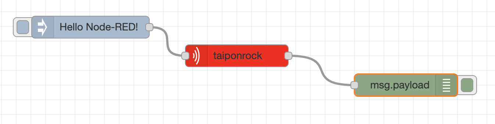

Injectノード実行後、デバッグウィンドウに結果が表示されていることを確認します。


## まとめ
おつかれさまでした。ノードを自作すると言っても、思ったほど難しくはなかったのではないでしょうか。この手順をベースに、処理内容の作成や外観アレンジをしていただければ、既存に無い自分だけのお役立ちノードを公開して世界中の開発者へ使ってもらうことができますね！
