# Node-RED オリジナルノードの開発

## はじめに
本ハンズオンは、Node-RED公式サイトを元に、手順をまとめ直したものになります。ここでは、初めてノード開発を行う方向けに手順をシンプルにしています。
オリジナルの情報は [Node-RED公式サイト ノードの開発](https://nodered.jp/docs/creating-nodes/) を御覧ください。

## 事前準備
本ハンズオンを実施するに当たり、以下を事前準備してください。
* [GitHub](https://gist.github.com/) アカウント作成
* [npm](https://www.npmjs.com/) アカウント作成
* [Node-RED](https://nodered.jp/) インストール (ローカル環境へのスタンドアロン)

## 全体の流れ
ノード開発の主な流れは以下の通りです。
1. ノードプログラム開発(JavaScript)
2. ノード外観作成(HTML)
3. パッケージ化
4. ノードのインストール
5. ノード名の変更
6. ノード処理の変更
7. ノードアイコン変更
8. ノード色変更
9. フローライブラリへの公開
10. 公開したノードの削除
11. 公開したノードのインポート

## ノード開発のポリシー
新しいノードを作成する時には、いくつかの一般的なルールに従う必要があります。これらはコアノードで採用されているアプローチに準拠しており、一貫したユーザーエクスペリエンズを提供します。

ノード作成においては以下のルールに従います:

* 目的が明確に定義されていること
    * APIに含まれるすべての項目を設定できるようにしたノードは、 単一の目的のために分割した複数のノードよりも使いにくいことが多いです。

* 元の機能に関係なく簡単に使えること
    * 複雑さを隠蔽して専門用語やドメイン固有の知識の使用を避けます。

* 多様なメッセージ型が渡されても正常に処理できること
    * メッセージは文字列、数値、Boolean、Buffer、オブジェクト、配列、nullなどの様々な型で渡される可能性があります。 いずれの型であっても正しく処理される必要があります。

* 送信される内容に一貫性を持つこと
    * ノードはメッセージにどのようなプロパティを追加するのかを文書化する必要があり、動作において一貫性があり、 予測可能でなければなりません。

* フローの先頭、中間、または末尾に配置されるようにすること - すべてを一度にしようとしないこと

* エラーをキャッチすること
    * ノードがキャッチできないエラーをスローすると、 Node-REDはシステム全体の状態がわからなくなるため停止します。
    * ノードはできるかぎり、 エラーをキャッチするか非同期呼び出しのためのエラーハンドラを登録しなければなりません。


## 1. ノードプログラム開発(JavaScript)
Node-REDのノードは、処理を定義するJavaScriptファイルと、設定画面などのUIを提供するhtmlファイルの2つから構成されています。
JavaScriptでは、前のノードから渡されたメッセージに対して行う処理を実装します。htmlファイルは、Node-REDのフローエディタで表示されるプロパティ設定画面が記述されています。このhtmlファイルで表示したプロパティ設定画面で入力した設定値をjsファイルから呼び出して処理を行います。

### 1-1. 開発用リポジトリの準備
https://github.com/ へアクセスし、GitHubアカウントでログインします。
GitHubページの右上にある「＋」プルダウンから「New repository」を選択します。


ここで作成するリポジトリは、ノードを開発するためのプロジェクトとして存在し、その後パッケージ化されてnpmへ公開されるものになります。（公開するかどうかはもちろん任意です）

ですので、リポジトリ名はノード開発の命名規則に沿ったものにしましょう。

ルールでは「node-red-contrib-<ノードのグループを表す名称>ですので、これに従います。以下の画像ので例では「node-red-contrib-taiponrock」にしています。
リポジトリ名を指定したら、リポジトリ公開範囲をPublicにし、READMEファイルのチェックをONにして、ライセンスを指定します。例ではApache License 2.0ライセンスで作成します。
すべて設定したら「Create repository」ボタンをクリックしてリポジトリを作成してください。

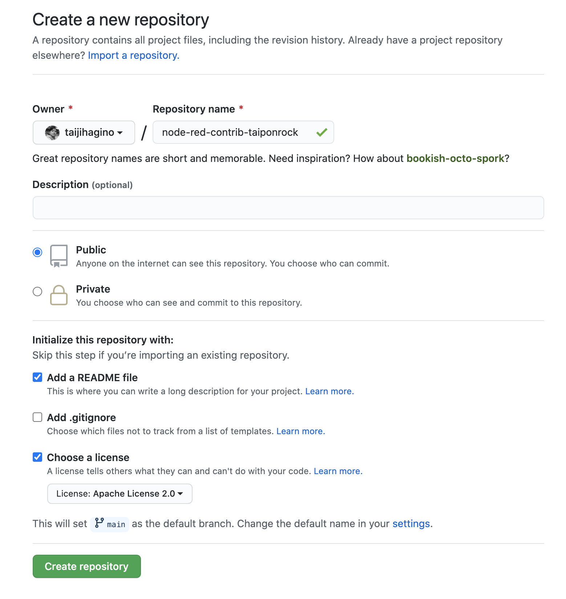


無事リポジトリが作成されました。

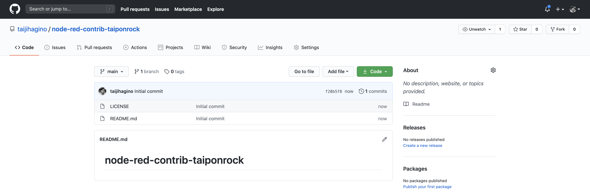

### 1-2. リポジトリのClone
では、次にローカルの開発環境に、先程作成したリポジトリをクローンしましょう。

リポジトリのURLをクリップボードへコピーします。緑色の「Code」のプルダウンをクリックして、クリップボードボタンをクリックしてURLをコピーします。

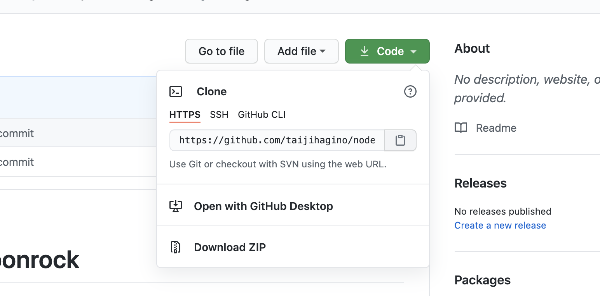


リポジトリをローカルに取得(git clone)
Bashが実行できるコマンドラインインターフェース（ターミナルなど）からリポジトリをクローンする（コピーする）作業ディレクトリへ移動します。ここでは、ユーザーディレクトリの下へworkディレクトリを作成し、そこへ移動しました。

```
$ mkdir work
$ cd work
```

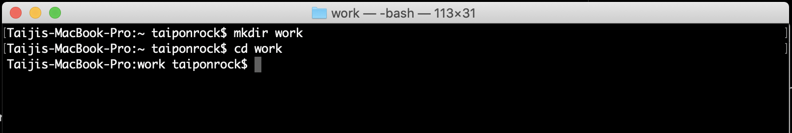

先程作成したリポジトリのURLで```git clone```コマンドを実行してください。クローンが終了したら、```ls```コマンドで正常にクローンされていることを確認しましょう。

```
git clone https://github.com/<GitHubアカウント>/node-red-contrib-<指定した任意の文字列>.git
```

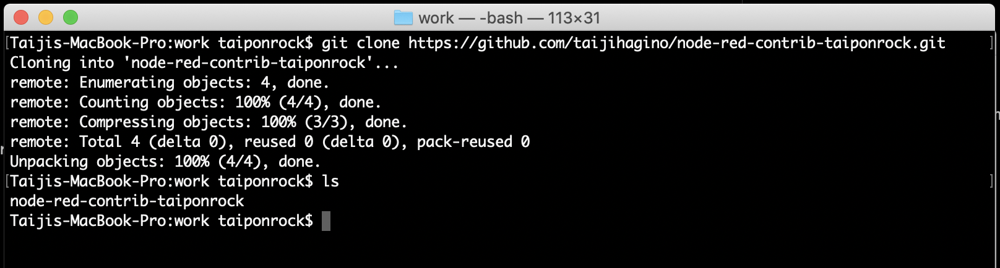


### 1-3. Javascriptの作成
ここからは、実際のノードの処理を作成します。と、言ってもすでにコードは用意してありますのでご安心ください。
用意してあるコードは非常にシンプルな処理のノードになります。インプットとして渡された文字列を小文字(lower case)に変換するだけの処理です。

まずは、クローンしたリポジトリのディレクトリの中へ移動します。

```
cd node-red-contrib-<指定した任意の文字列>
```


こちらのディレクトリ配下に、以下のコードの通り **node.js** というファイル名で、ファイルを作成します。
```
module.exports = function(RED) {
    function LowerCaseNode(config) {
        RED.nodes.createNode(this,config);
        var node = this;
        node.on('input', function(msg) {
            msg.payload = msg.payload.toLowerCase();
            node.send(msg);
        });
    }
    RED.nodes.registerType("lower-case",LowerCaseNode);
}
```

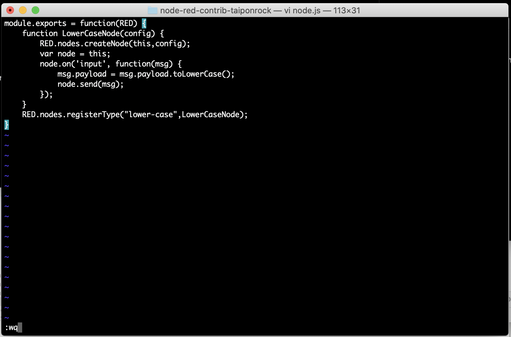

node.jsが作成されました。

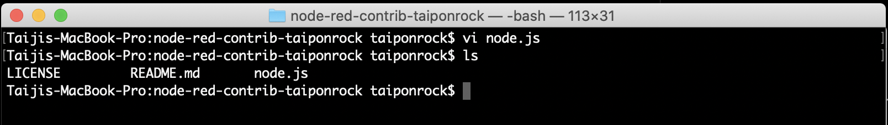

ここではviを使って作成していますが、もちろん任意のエディターを使って構いません。

### 1-4. HTMLの作成
続いて、同じディレクトリ配下に、以下のコードの通り **node.html** というファイル名で、ファイルを作成します。

```
<script type="text/javascript">
    RED.nodes.registerType('lower-case',{
        category: 'function',
        color: '#a6bbcf',
        defaults: {
            name: {value:""}
        },
        inputs:1,
        outputs:1,
        icon: "file.png",
        label: function() {
            return this.name||"lower-case";
        }
    });
</script>

<script type="text/x-red" data-template-name="lower-case">
    <div class="form-row">
        <label for="node-input-name"><i class="icon-tag"></i> Name</label>
        <input type="text" id="node-input-name" placeholder="Name">
    </div>
</script>

<script type="text/x-red" data-help-name="lower-case">
    <p>A simple node that converts the message payloads into all lower-case characters</p>
</script>
```

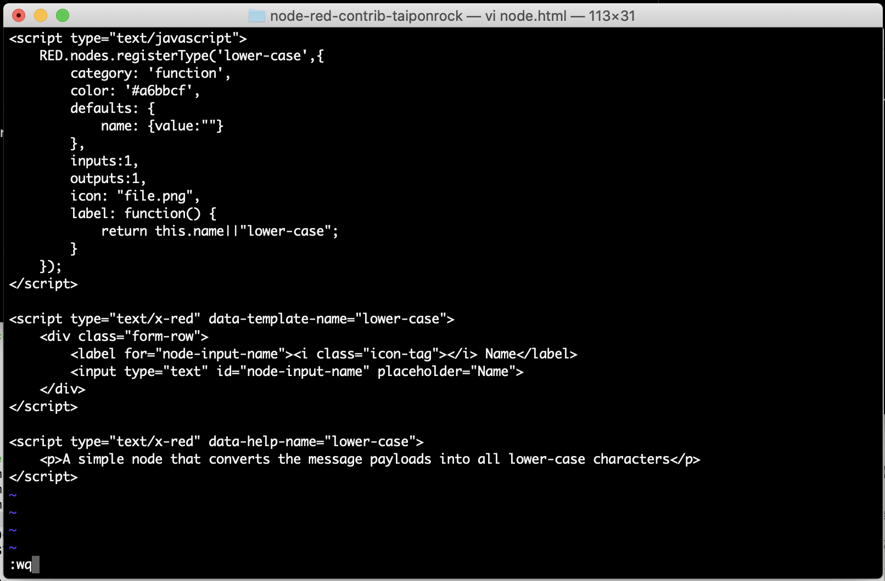

node.htmlが作成されました。

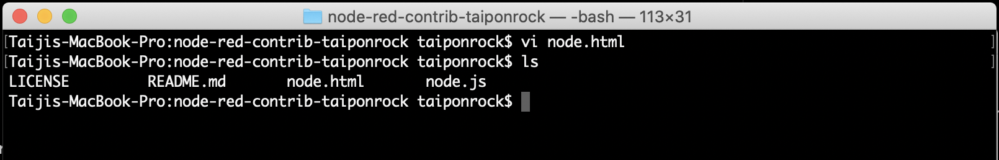

## 2. パッケージ化
ノードの処理(JavaScript)と外観(HTML)の作成が終えたので、今度はそれをパッケージ化していきます。Node-REDはそのフローエディタ自身がnode.jsアプリであり、そこの上で動く各ノードもまたnode.jsアプリということになります。つまり、ここでのパッケージ化というのは **npm** を使った処理のことです。

npmについてはここでは詳しく説明しません。詳細を知りたい方は [npm公式サイト](https://www.npmjs.com/) へアクセスいただくか、各種技術記事などをご参照ください。

### 2-1. npmの初期化処理
先程、node.jsやnode.htmlを作成したディレクトリと同じ場所で、以下の通りコマンドを実行します。

```
npm init
```

npm initを実行すると、対話式に各種パラメーターを聞かれますので、いかに従い入力して先に進んでください。

| 項目 | 設定値 |
----|---- 
| name | デフォルト値 |
| version | デフォルト値 |
| description | ノードの説明 (ライブラリやインストール時の説明として表示される) |
| entry point | デフォルト値 |
| test command | ※入力不要 |
| git repository | デフォルト値 |
| keywords | インストール時の検索等で用いるキーワードをカンマ区切りで指定。今回はライブラリ登録予定なので「node-red」を忘れずに入力すること。 |
| author | npmアカウント名 |
| license | Apache-2.0 (任意のものでOK) |

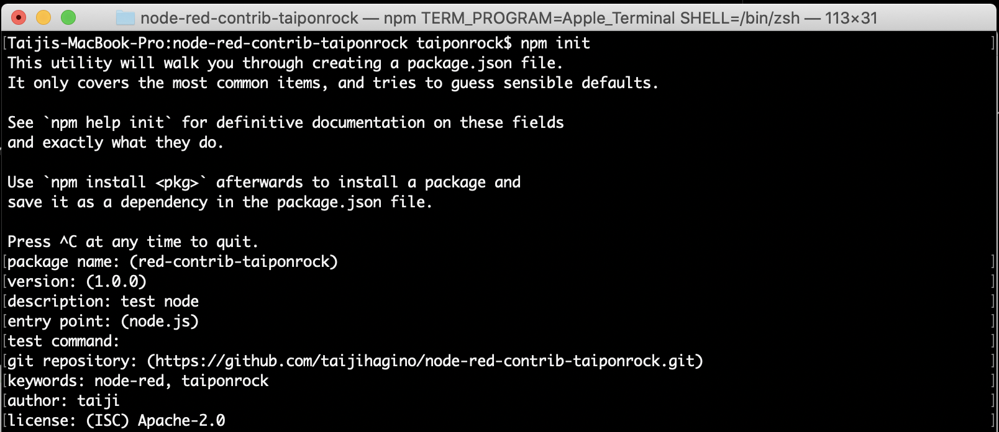

最後まで対話を終了するとnpm initコマンドにより **package.json** が生成されます。

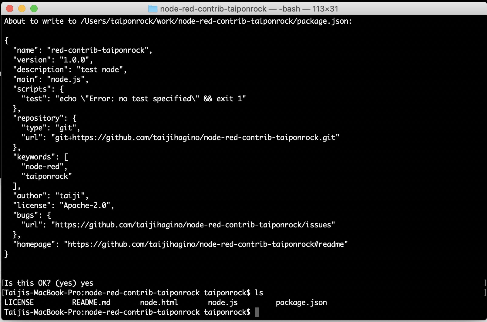

### 2-2. package.jsonの編集
package.jsonには、手動でNode-RED固有の設定を追加する必要があります。package.jsonファイルをテキストエディタで開き、以下の様に"name"や"version"と並列して ```"node-red":{"nodes":"{"lower-case":"node.js"}},``` の部分を追加します。

```
{
  "name": "node-red-contrib-<指定した任意の文字列>",
  "version": "1.0.0",
  (省略)
  "node-red" : {
    "nodes": {
      "lower-case": "node.js"
    }
  },
  (省略)
}
```

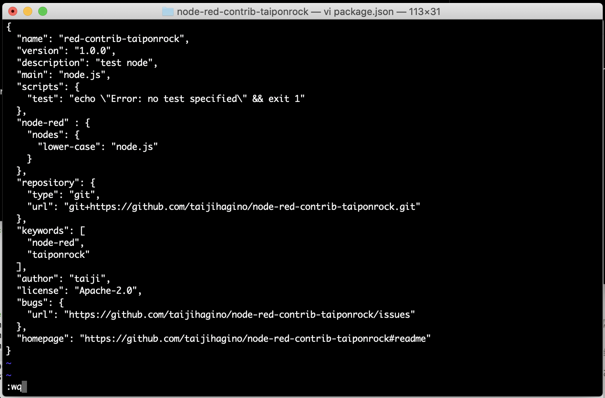

## 3. ノードのインストール
ここまでで作成したノードを、ローカル環境のNode-REDへ追加していきましょう。

ノードモジュールをローカルでテストするには ```npm install <folder>``` コマンドを使うことができます。 これにより開発中において、ローカルディレクトリでノードを開発し、ローカルのNode-REDインストールにリンクさせることができます。

CLI上で以下の通りコマンドを実行し、ノードの追加とNode-REDの起動を行います。

```
$ npm install <ノードモジュールへのパス>
```

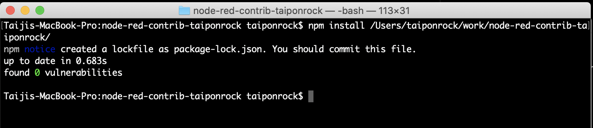

これにより、ディレクトリへ適切なシンボリックリンクが作成され、 Node-REDは起動時にノードを検出します。 Node-REDを再起動するだけで、ノードのファイルに対する変更を取得できます。

コマンドラインで ```node-red``` コマンドを実行し、ローカルのNode-REDを起動します。すでに起動済みの場合は再起動してください。

起動後（再起動後）のパレットのfunctionカテゴリに **lower case** というノードが追加されていることが確認できるはずです。

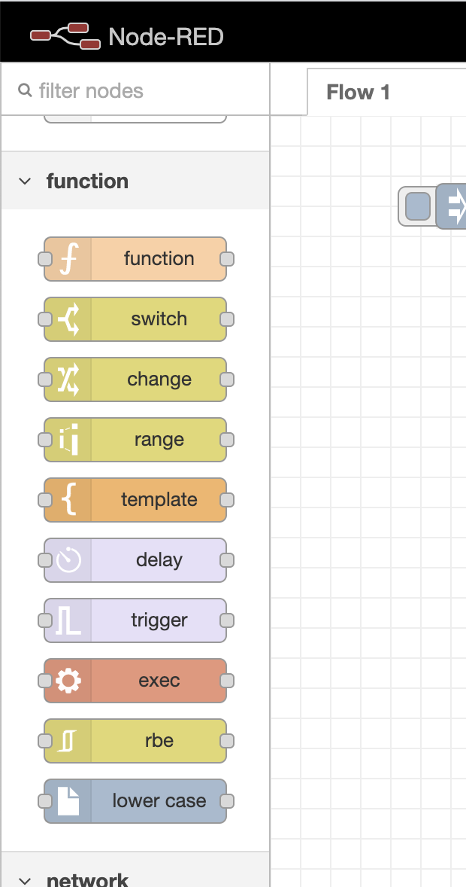


## 4. ノード名の変更
## 5. ノード処理の変更
## 6. ノードアイコン変更
## 7. ノード色変更
## 8. フローライブラリへの公開
## 9. 公開したノードの削除
## 10. 公開したノードのインポート
